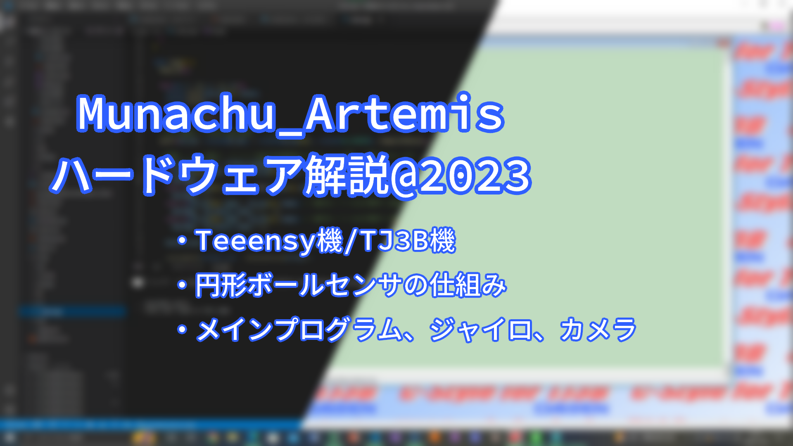

##### 公開:2022/00/00 更新:2022/00/00 writer:あさひ([@asahi_robocuper](https://twitter.com/asahi_robocuper))
---
 

# Munachu_Artemis ソフトウェア概要:2023

 
 
 

## プログラムやで～
---
どうも、あさひです。 
ようやく大会などなどひと段落したところなので、ここらで現行ロボのソフトウェアについての概要をまとめようと思います。 
(なお執筆時点(2022/11/27)、ひと段落どころか二週間後に福岡ノードを控えている事実…)
 
 

## ロボットはどんなもん？
---
まあ、ソフトウェア部分の解説のためにはハードウェアの理解が必要ですからね！前回の記事を見てくれたら分かると思います！(宣伝) 
 
 

## メインプログラム！
---

 
 

## そして大会へ...
---
今日の大会ではライトウェイト10チーム、オープン2チーム 
 
 

## センサーの校正
---
Arduino IDEを開き、「ファイル」→「スケッチ例」→「MPU6050」より、「IMU_Zero」を選択し、Seeeduino Xiaoにプログラムを書き込みます。
その後、センサーの校正が始まるので水平な部分で2~3分程放置をします。「Done」という文字列が表示されたら終了です。
校正した値は、Doneと表示された行の一行上の部分の値に表示されています(下の画像を参考)。 
 
 
緑枠の数字部分、左上から順番に[XAccel, YAccel, ZAccel, XGyro, YGyro, ZGyro] 
 
 

## 実際に値を出してみよう
---
「ファイル」→「スケッチ例」→「MPU6050」より、「MPU6050_DMP6」を選択し、下の画像の通りにプログラムを書き換えます。
具体的には、200行目付近にある関数の引数値を先ほど算出したセンサーの校正値に書き換えます。(赤文字部分) 
 
 
 
その後、プログラムをSeeeduino Xiaoに書き込み、センサーモニターを開くと値が出力されています。 
 
 
 
 

## まとめ
---
Arduino IDEのみでライブラリを導入できる機能を使用してSeeeduino XiaoでMPU6050を動作させようとするとライブラリ側のエラーが発生するので、
制作者のGithubからダウンロードしないといけないっていうのに気付くのに時間がかかりました。
皆さんもMPU6050をSeeeduino Xiao(というか、ATSAMD系統かな？)を使うときは気を付けましょう…。 
一応、僕たちのロボットではMPU6050を使って綺麗な角度制御をすることができました。 
これからMPU6050を使って綺麗な角度制御ができるようプログラムを頑張っていきたいと思います。 
 
(技術記事を書くのは初めてなので間違いなどありましたらTwitterやコメント欄などで教えてくれるとありがたいです...。)
 
