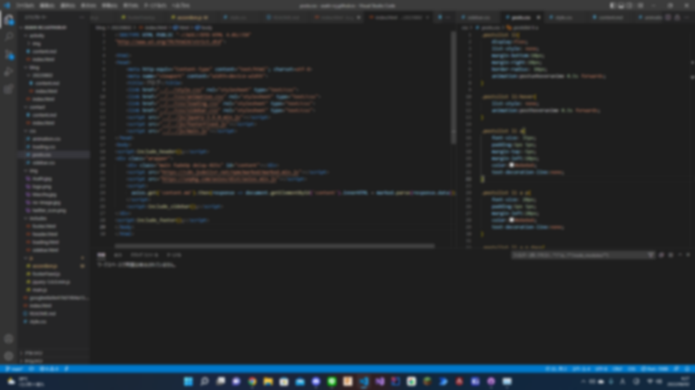

##### 公開:2022/08/02 更新:2022/08/02 writer:あさひ([@asahi_robocuper](https://twitter.com/asahi_robocuper))
---
 

# 初めてウェブサイトを作ってみたという話

 
 
 

## 初めに
---
> 初めましての人は初めまして。あさひです。  
> タイトルにもある通り、初めてウェブサイトを作ってみました。  
> ~~ちょいちょいコードをコピペした部分もありますが~~基本的に自分でコーディングしました。  
> というわけなんですが、ちょっとだけ私の自己紹介を。  
> RoboCupJunior LightWeight に参加している宗中アルテミスというチームのソフトウェア的役割をさせてもらっています。  
> このウェブサイトを作ったのもその一環っていうのがあるようなないような。  
> (~~もともと趣味で作ろうと思ってたんだけどね…~~)
 

## ウェブサイトを作ってみて
---
> 率直に言います。**くっそめんどかった。**  
> 何が面倒くさいって、まず自分の知識が何もなかった事。    
> ネット上を駆け回ってようやくここまでこぎつけたって感じです。  
> あと自分の性格上こういうのってとことん凝りたくなるんですよね…  
> その結果何が何だかわからないサイトになってしまいました。  
> でもまとまったのでヨシ！  
>
> 作ってみて一番便利だったのはMarkdown対応でした。  
> Markdown形式で書けるか書けないかって相当変わるんですね、実感しました。  
> 一番大変だったのは右側のサイドバーです。  
> アコーディオンアニメの実装がめっちゃくちゃ大変だった…。  
> ただその分いい感じのまとまりになったのではないでしょうか。
 

## これから
---
> このブログ、本当は自動でタイトル取得して…とかやりたかったんですけど、僕の技術不足で断念しました。  
> ただ、とりあえず形にはなったので、これを利用していろんな形で情報共有できたらなと思っています。  
> とりあえず初記事はここらへんで締めさせていただきます。ありがとうございました。